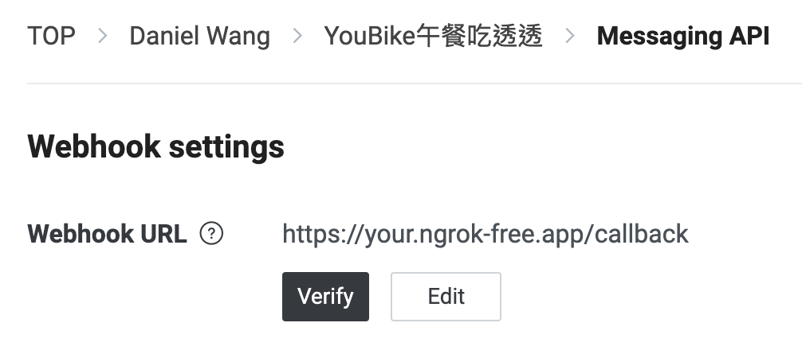

# KPMC LINE BOT
#### 利用Google Maps API與YouBike API來提供使用者快速查詢附近餐廳及單車站點的LINE Bot
## 檔案結構
```
.
├── app.py # 主程式
├── flex_messages # 存放 Flex Message 的 Json 檔案
│   ├── GoogleMaps.json
│   └── YouBike.json
└── utils
    ├── distance.py # 距離相關函數
    ├── flex_message.py # 載入 Flex message
    ├── google.py # Google Maps API
    └── youbike.py # YouBike API

3 directories, 8 files
```
## 使用方式
### 建立LINE Bot
至`https://developers.line.biz`建立LINE Bot
網路上已有許多教學資源，故不在此處提供詳細步驟
### Clone本專案
```bash
git clone https://github.com/DanielWang2002/KPMC_LINE_Bot.git
cd KPMC_LINE_Bot
```
### 安裝套件
```bash
pip install -r requirements.txt
```
### 修改環境變數
- 將`.env.template`更名為`.env`
- 在`.env `內填寫LINE Bot及Google Maps API相關Token/Key
### 啟動LINE Bot程式
```bash
python app.py
```
### 將程式轉發到網際網路上
該步驟可用任何方法，以下使用`ngrok`
```bash
ngrok http 8000
```
### 更新LINE Bot Webhook URL
將Webhook URL改成ngrok提供的網址加上`/callback`

點擊Verify若出現Success即代表Bot已部署成功